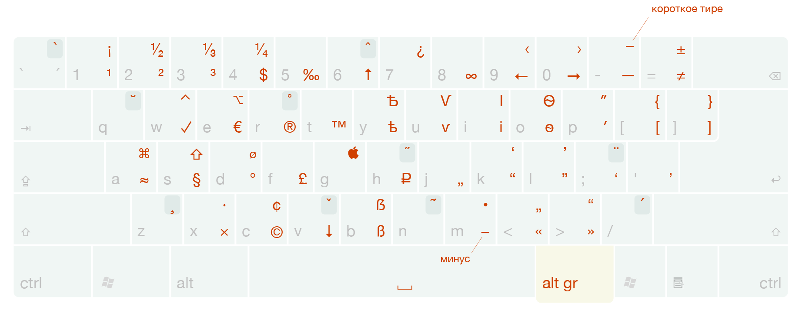
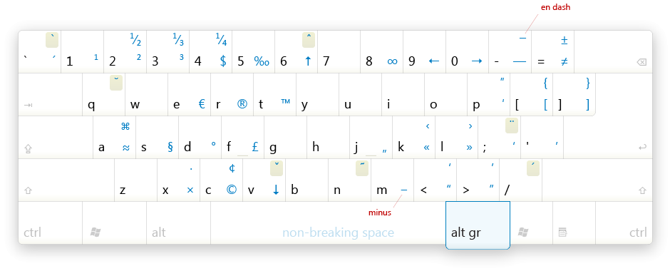

# Типографская раскладка Ильи Бирмана для xkb

Данный репозиторий содержит адаптацию русской и английской [типографской раскладки Ильи Бирмана](http://ilyabirman.ru/projects/typography-layout/) версии 3.7 для xkb (x11-keyboard). Склонировано из [репозитория для убунту](https://github.com/neochief/birman-typography-layouts-for-ubuntu).





## Фичи раскладки

Эта раскладка позволяет вводить полезные символы, используя правый <kbd>Alt</kbd> (называемый AltGr). Например, чтобы получить знак евро **€**, вам нужно нажать <kbd>AltGr</kbd>+<kbd>У</kbd> в русском варианте или <kbd>AltGr</kbd>+<kbd>E</kbd> в английском. Дополнительный ряд символов доступен при нажатии еще и <kbd>Shift</kbd>+<kbd>а</kbd>, например <kbd>AltGr</kbd>+<kbd>С</kbd> даст знак копирайта **©**, а <kbd>AltGr</kbd>+<kbd>Shift</kbd>+<kbd>С</kbd> даст знак цента **¢**.

## Установка

1. Клонируйте репозиторий и запустите скрипт с повышенными привелегиями:

    ```sh
    git clone git@github.com:muxal37/birman-typography-layouts-for-fcitx5.git /tmp/layouts
    sudo sh /tmp/layouts/install.sh
    ```

2. **Перезапустите систему!**

### fcitx5
В `fcitx5-configtool` выберите установленные раскладки.
    
!!! Рекомендую также отключить опцию `use new compose behaviour` в панели `configure`, чтобы избавиться от окна, которое будет вылезать при наборе композиционных символов.

## Дополнительная информация

В отличие от версии [для Убунту](https://github.com/neochief/birman-typography-layouts-for-ubuntu), не ставит <kbd>AltGr</kbd>  мёртвой клавишей, а делает его *ISO_Level3_Shift* модификатором.

Теоретически, раскладки должны работать в любом дистрибутиве на *X11* и *Wayland*, с любыми средствами IME и без них.
    
## СДЕЛАТЬ

-   [ ] Дать пользователю возможность заменить клавиши, специфичные для Apple, на Линуксовые 
-   [ ] Дать пользователю возможность поменять местами <kbd>Caps Lock</kbd> и <kbd>ESC</kbd>
-   [ ] Дать пользователю возможность добавить <kbd>÷</kbd> как <kbd>AltGr</kbd>+<kbd>/</kbd> 
-   [ ] Дать пользователю возможность синхронизировать английскую клавиатуру с русской
-   [ ] Добавить английскую версию документа `README_EN.md`, поддерживать оба языка в install.sh

